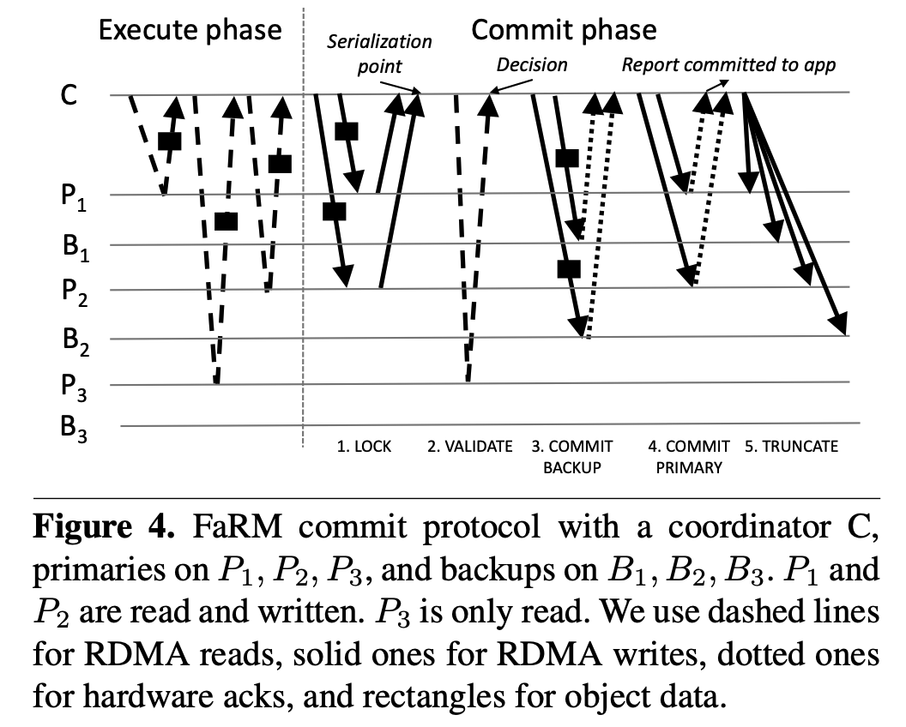

# 6.824_P14_FaRM

前12节课的视频，建议参考翻译https://mit-public-courses-cn-translatio.gitbook.io/mit6-824/

这篇文章只是记录一些要点和自己的思考，有助于理解第14节课，但和之前的翻译相比，区别较大

FaRM这篇论文的题目是：不妥协：事务、一致性、可用性和性能，换句话说我都要。。。

FaRM自己定义为分布式内存计算架构。它基于RDMA（远程直接内存访问）和NVRAM（非易失内存）重新设计事务、副本和恢复协议，从而实现了高性能、强一致性和高可用。

## NVRAM

FaRM的操作都直接在内存中进行，它实现NVRAM的方式是备用电源，当数据中心停电时，启用备用电源，将内存中的数据保存，然后等待重新供电、恢复。这样的设计，只能应对停电时内存数据的保存，其他如软、硬件故障会引起数据丢失。FaRM这样设计的原因是，他认为只有停电这种情况，才会造成大量节点同时故障，其他问题造成的少数节点故障，由于有数据副本的存在采用其他方式进行恢复。

## Bypass Kernel

传统的网络架构中，应用层数据要经过层层协议栈发送出去，接收方也要经过层层协议栈才能在应用层处理数据，FaRM认为这样延时比较严重，因此采用Bypass Kernel策略，应用层直接达到NIC(network interface card)。

## RDMA

RDMA是一种技术，全称是Remote Direct Memory Access，CPU访问远程计算机的内存仿佛可以直接访问，速度很快。FaRM中使用的是one-side RDMA，原节点可以直接远程访问目的节点的内存数据。

但是单纯的one-side RDMA无法执行读写事务，因为需要锁和协调。如果RDMA能够支持更多的操作，比如test&set、atomic，也许可以基于此实现事务

## OCC

乐观的一致性控制，在事务执行的过程中，读不需要锁（FaRM在这里使用了one-side RDMA），写的话先写入缓存，当事务准备提交时，会检查事务是否符合一致性，如果成功，则事务提交，否则事务取消。

事务提交前的一致性检查是如何实现的呢？

每个数据都有一个Lock标记和一个版本记录，以下图为例，事务开始后，C读取了数据获得了数据Version，然后在本地进行写操作，当需要进行提交时，首先向每个写数据的Primary节点发送数据，并检查锁和数据版本，如果数据锁定或者版本发生了变化，则返回失败，C会通知事务各方事务失败。如果返回成功，则C验证P3的数据是否发生变化（包括锁定或者版本变化），如果数据有变验证失败，则通知各方取消事务。如果验证成功，则向Backup节点发送数据，然后提交事务，通知各节点事务成功，应用事务变化，释放锁和相关记录。

