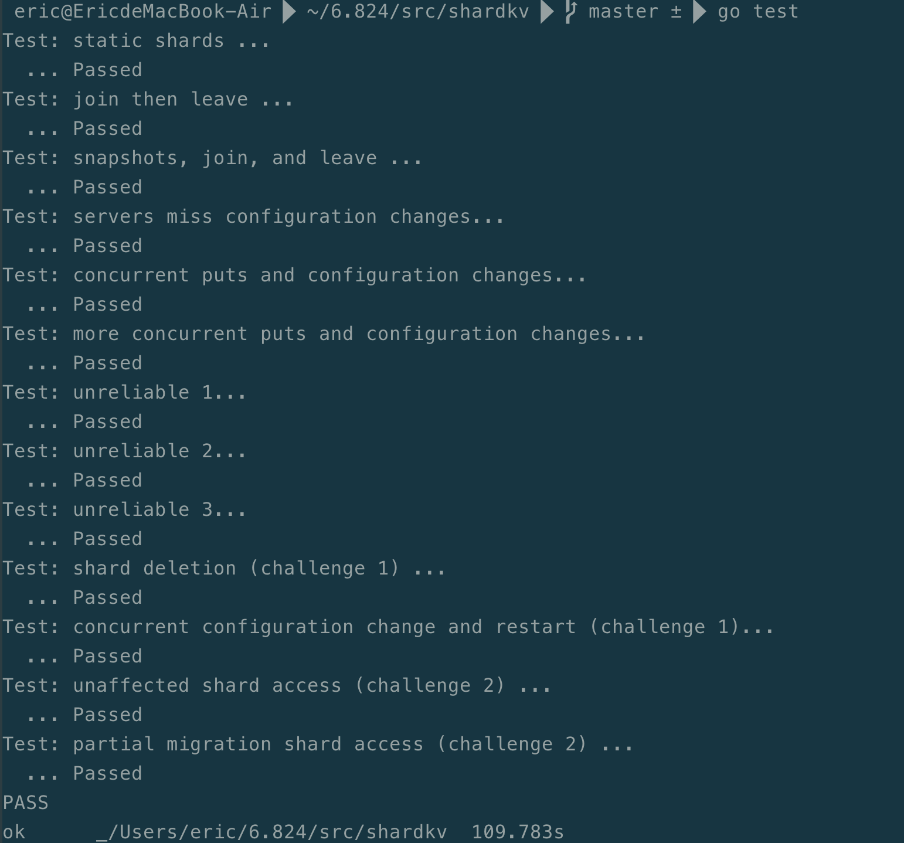

# mit6.824Lab随笔

最近一段时间学习了MIT的经典分布式系统课程6.824（2020版）。

课堂教学方面的话，B站有视频，部分章节带中文字幕，另有翻译https://mit-public-courses-cn-translatio.gitbook.io/mit6-824/，感谢！

实验部分是这门课程的一大亮点，花了一些时间通过实验和测试，特别是Lab2-4一步步引导实现了一个分布式的Key-Value数据库系统，感觉MIT的老师、助教还是花了一些心思的，对学生系统设计思维的培养很好。

学这门课程对我来讲算是分布式系统设计的入门，虽说稳定的通过了所有测试（反复测试多次），但是在实验的过程中，明显感觉到有些地方自己设计的不是那么巧妙，后续准备好好学习一下工业界在这些细节的地方都是如何设计实现的。

课程的老师特别提醒大家不要公开自己的代码，出于对课程的保护，我也不会公开代码，只是总结一下自己在这个过程中的一些思考和踩过的坑。

## Lab2

Lab 2主要是实现Raft算法，论文已经把设计的介绍的比较详细了，仔细读几遍就能知道大概怎么做了。

### 选举

每个节点都会有一个goroutine来负责检测是否需要启动新一轮的选举。检测的方法是随机休眠一段时间，在休眠开始前将心跳检测标记置位，休眠结束后如果发现心跳检测标记仍处于置位状态，则表明没有收到心跳包，则开启新一轮选举。选举时要有选票计数，收到足够数量的响应和选票，则当选Leader。

选举投票时，要检查请求方是否比自己轮次高，本轮是否已经投票，以及请求方的日志是否比自己的日志更新（这一条保证只有已提交数据的节点才有可能成为新的Leader，从而保证提交的数据不会丢失）。

### 心跳

只有Leader节点需要向其他节点发送心跳包，所以只有当选了Leader，才起一个发送心跳包的goroutine，发送心跳包前检查自己的状态，如果已经不是Leader或者轮次变了，就要退出。另外不要忘记把自己的心跳检测标记复位。每个节点，收到合法的心跳包，要将自己的心跳检测标记复位。

### 日志复制

复制日志时消息携带前一个日志项的Term和索引，接收方根据前一个日志项进行匹配，匹配的话可以完成复制，不匹配的话，返回失败，发起方要将复制内容向前退。收到复制成功的话，检查已经收到该日志项的节点数量，如果超过半数，则可以提交。提交时，所有早于该日志项的日志均可以提交。复制内容向前回退时，为了提高速度每次可以回退一个Term的日志项。

### 持久化

确定需要持久化的内容，然后启动的时候检查是否有持久化的数据可以读取。

### 超时

我在Lab2中遇到的最大的问题就是不能稳定通过Unreliable网络的测试，主要原因是超时，Lab自带的网络模拟对超时的处理不好，因此添加了超时重发的机制。

```go
//go 超时设计方案
	ch := make(chan bool)
	done := make(chan struct{})
	go rf.sendEntryAppendAndWait(ch, done, server, args, reply)

	select {
	case ok := <- ch:
		rf.dealAppendEntryReply(server, args, reply, ok)
	case <- time.After(time.Duration(50) * time.Millisecond):
		close(done)
		//fmt.Println("timeout")
		rf.retryWihleNoReply(server, args, false)
	}

//在sendEntryAppendAndWait中
//发送消息，然后等待
	select {
	case ch <- ok:
	case <- done:
	}
	return
```


## Lab3

### KV存储和去重

客户端向服务端节点发送请求，如返回WrongLeader信息，则换一个节点继续请求。服务端KV层收到请求后，将操作交给Raft层，如果Raft层 节点不是Leader，则返回Wrong Leader，如果Raft层节点是Leader，则KV层得到操作在Raft层日志中的索引Index0。当KV层检测到操作提交后，按操作处理数据。在等待数据提交的过程中，KV层周期性比较提交的日志项索引Index1和Index0，当Index1 >= Index0时返回客户端提交成功信息。

为了防止重复提交，给每个客户端一个随机数标识，每次请求一个递增的请求序号，在服务端，记录每个客户端的最大的请求序号，只有更大序号的请求到达时，在进行数据修改。不足：这部分没有做数据过期。

### 快照

快照时KV层要将最后包含在快照内的日志Index传递给Raft层，Raft层做持久化，保证两层在同一时刻做了持久化。安装其他节点发送过来的快照时要要保证两层在同一时刻做了持久化。使用raft层snapIndex保存当前快照内的Index，所有处理都要考虑log内的日志项和已经被快照保存的日志项。

### 小心死锁

```go
//一种死锁的情况如下
//a kv layer 发送请求给raft层：获取kv锁,然后raft层获取状态又需要raft层锁。（后来检查这个地方不需要kv层加锁，也不需要检查raft层节点状态，因此在Lab3中解决了死锁问题，但是在Lab4中这个地方会在此遇到死锁问题)
kv.mu.Lock()
term, isleader := kv.rf.GetState()
if isleader {
  index, term, isLeader := kv.rf.Start(op)
}
kv.mu.Unlock()
//b kv layer 接收提交
for {
  x := <- ch
	kv.mu.Lock()
	//deal commit
	kv.mu.Unlock()
}
//c raft层向kv层提交数据
rf.mu.Lock()
for many {
 	ch <- rf.data 
}
rf.mu.Unlock()
//死锁发生在a段程序获取了kv层锁，等待raft层锁；b段程序获取了channel数据，等待kv层锁；c段层序获取了raft层锁，但是channel数据组塞
//前面提到a段程序无需获取锁，因此这个地方的死锁也就不存在了。这个地方发生死锁的另一个原因是c段程序一次锁定可能会向channel发送多个数据项，而此处channel是非缓冲channel。
```

检查死锁主要一是检查是否忘记了释放锁，二是是否获取了一把锁之后又获取另一把锁。

## Lab4

### shardmaster

### map访问没有顺序

Lab4的提示里有关于Map访问顺序的提醒，奈何我没有认真去看，导致踩坑。

踩坑的情况发生在虽然同一个Group的节点看到了相同的Join、Leave操作，但是其数据是用map存储的，不同的节点使用range访问map时，顺序不一致，导致生成的配置结果不一致，当放生Leader切换时，获取到的同一个配置需要的配置不同，引起错误。

### 增加测试

另一个问题时，当时在shardmaster测试阶段并没有测出问题（看了测试代码，有切换Leader的场景，但是只测0-1-2-1-0，且每次Join/Leave 1个gid），而是到了shardkv时才遇到问题，给问题排查增加了困难。

```go
//增加测试
func TestMapOrder(t *testing.T) {
	const nservers = 3
	cfg := make_config(t, nservers, false)
	defer cfg.cleanup()

	ck := cfg.makeClient(cfg.All())

	fmt.Printf("Test: Map range order ...\n")

	cfa := make([]Config, 10)
	cfa[0] = ck.Query(-1)

	check(t, []int{}, ck)

	var gid1 int = 1
	ck.Join(map[int][]string{gid1: []string{"x", "y", "z"}})
	check(t, []int{gid1}, ck)
	cfa[1] = ck.Query(-1)

	var gid2 int = 2
	ck.Join(map[int][]string{gid2: []string{"a", "b", "c"}})
	check(t, []int{gid1, gid2}, ck)
	cfa[2] = ck.Query(-1)

	var gid3 int = 3
	ck.Join(map[int][]string{gid3: []string{"1", "2", "3"}})
	check(t, []int{gid1, gid2, gid3}, ck)
	cfa[3] = ck.Query(-1)

	ck.Leave([]int{gid1})
	check(t, []int{gid2, gid3}, ck)
	cfa[4] = ck.Query(-1)

	ck.Leave([]int{gid2})
	check(t, []int{gid3}, ck)
	cfa[5] = ck.Query(-1)

	ck.Join(map[int][]string{gid1: []string{"x", "y", "z"}, gid2: []string{"a", "b", "c"}})
	check(t, []int{gid1, gid2, gid3}, ck)
	cfa[6] = ck.Query(-1)

	var gid4 int = 4
	ck.Join(map[int][]string{gid4: []string{"4", "5", "6"}})
	check(t, []int{gid1, gid2, gid3, gid4}, ck)
	cfa[7] = ck.Query(-1)

	ck.Leave([]int{gid2, gid4})
	check(t, []int{gid1, gid3}, ck)
	cfa[8] = ck.Query(-1)

	ck.Join(map[int][]string{gid2: []string{"a", "b", "c"}, gid4: []string{"4", "5", "6"}})
	check(t, []int{gid1, gid2, gid3, gid4}, ck)
	cfa[9] = ck.Query(-1)

	for s := 0; s < nservers; s++ {
		cfg.ShutdownServer(s)
		for i := 0; i < len(cfa); i++ {
			c := ck.Query(cfa[i].Num)
			check_same_config(t, c, cfa[i])
		}
		cfg.StartServer(s)
		cfg.ConnectAll()
	}

	fmt.Printf("  ... Passed\n")
}


func TestMapOrder100Time (t *testing.T) {
	for i := 0; i < 100; i++ {
		fmt.Println(i)
		TestMapOrder(t)
	}
}
```


### shardKV

不同于Lab2已经有了详细的设计方案，Lab3也是在Lab2的基础上添加一层。Lab4需要一些整体的设计，不然有种无从下手的感觉。

### 架构

对于一个Group来讲，每个节点对于shard的响应或是不响应应该是一致的，为了保证这种一致性，配置信息应该通过raft Log传递，这样每个节点，在新的配置信息提交之前按照旧的配置信息进行响应，新的配置信息提交之后，按照新的配置信息进行响应。所有节点对于shard的响应是一致的。

谁来负责获取配置，Leader。只有Leader获取了配置，然后直接传给raft层才能在raft log中传递（kv.rf.Start()），其他节点，即便获取了配置，其raft层也不支持在log中传递（需要作为一个客户端，然后向Group内的server发送请求）。

传递配置的具体内容还是只传序列号，传具体内容。如果只传序列号，那么在follower节点获取序列号后还要查询shardmaster，并且在正确返回之前，无法进行其他操作。

配置更新了数据怎么办？由Leader传递给另一个Group。一旦配置更新，那么在新的配置中不再由该Group负责的shard，之前的操作已经全部提交，之后的操作不再响应，此时可以将数据进行转移。

接收shard的Group应该如何接收？Leader接收放在日志中传递。这样能确保接受shard的Group的每一个节点在日志中同样的位置接受shard数据，并在之后开始对数据进行响应。

传递完毕后，接收的Group要响应发送Group，发送Group可以进行相应数据的删除。

### 配置更新

配置更新要按序号进行，一个配置更新进入平稳之后，在进行下一个配置的更新。对每个shard设置标志位，所有shard都完成更新后，该配置进入平稳状态。接收到相应的shard后，可以将对应的shard标志位更新，后续可以响应该shard的请求，而不必等待所有shard更新状态，整个配置更新完毕之后才响应客户端请求。

### shard转移

高配置序号的Group对低配置序号的Group的shard转移请求可以直接响应OK。因为Group可以进入高配置序号说明已经获取了相应shard。低配置序号Group对高配置序号Group的shard转移请求返回Err，此时不能接受数据，避免数据覆盖。

处于不同配置序号的Group为什么最终能够到达同样的最终配置？比如说由于快照、重启等原因，Group A当前配置序号是5，Group B当前配置序号是2（Group内配置序号以Leader为准，因为他们Log相同，几遍Follower当前配置序号较低，但是Log中已经有了相应数据，随着Log提交，会与Leader相同）。处于配置5的Group，由于其配置2平稳后才能进入配置3，配置3平稳后才能进入配置4，配置4平稳后才能进入配置5，肯定已经在配置2时将需要传递给其他Group的数据传递给了其他Group，并且已经在其他Group的Log中传递，由于raft的持久化机制，那么该数据肯定已经被保存，低配置序号Group只需等待Log提交即可，肯定也已经接收到了配置2时需要接收到的shard才能进入配置2的平稳状态，然后依次更新配置3、进入配置3平稳状态。。。。同时呢，如果此时高配置版本Group需要发送shard转移请求给低配置版本Group，则会得到Err响应，无法进入平稳状态，进而进入更高配置版本。对于低配置版本的Group，他在低配置版本时所需的数据在Log中，需要发送给高配置序号Group的转移请求会直接得到相应OK，因此可以逐渐提交数据，向高配置版本进步。

### 通过

上面说的很绕，需要一点点思考，其实没有那么复杂，动手试试也就一点点解开了。



## 总结

实验给我的感觉是一眼望过去好像难度很大，但实际做起来其实也不难，最重要的是一定要相信自己能解决，然后动手去做，实在做不出来的时候就想一想，理理思绪。

上面这些内容就是记了个大概，毕竟要留给大家思考的空间（其实是我表达能力有限，还懒的细说），如果大家有问题的话可以找我讨论，但是我还是那句话，一定要相信自己能解决，然后动手去试。